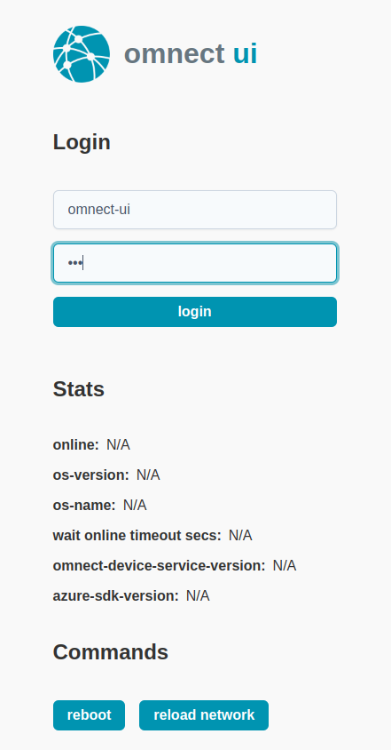
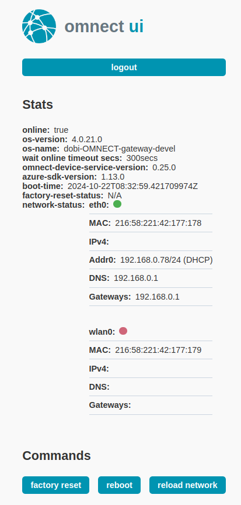
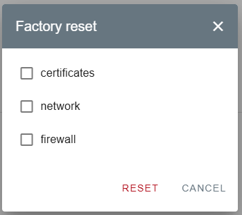
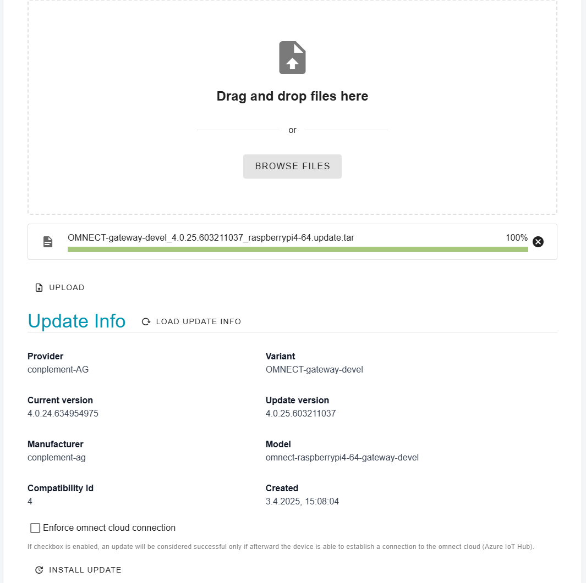

# omnect-ui

Product page: <www.omnect.io>

This module implements a web frontend and backend to provide omnect specific features in a local environment, where the device might not be connected to the azure cloud. In that case the device cannot be remotely controlled by [omnect-portal](https://cp.omnect.conplement.cloud/) and omnect-ui might be the alternative.

## Install omnect-ui

Since omnect-os is designed as generic OS, all specific or optional applications must be provided as docker images via azure iotedge deployment:

- deployment of omnect-ui docker image via omnect-portal to a device in field
- device must be online (at least once) in order to receive the deployment and to set initial password
- after a factory reset omnect-ui must be deployed again what requires a connection to azure cloud

## Access omnect-ui

omnect-ui can be reached at <https://DeviceIp:1977> 

Login with the configured password 
 
Watch device status 
 
Reset device and choose options to keep 
 
Update your device 

# License

Licensed under either of

- Apache License, Version 2.0, (./LICENSE-APACHE or <http://www.apache.org/licenses/LICENSE-2.0>)
- MIT license (./LICENSE-MIT or <http://opensource.org/licenses/MIT>)

at your option.

# Contribution

Unless you explicitly state otherwise, any contribution intentionally
submitted for inclusion in the work by you, as defined in the Apache-2.0
license, shall be dual licensed as above, without any additional terms or
conditions.

---

copyright (c) 2024 conplement AG 
Content published under the Apache License Version 2.0 or MIT license, are marked as such. They may be used in accordance with the stated license conditions.
